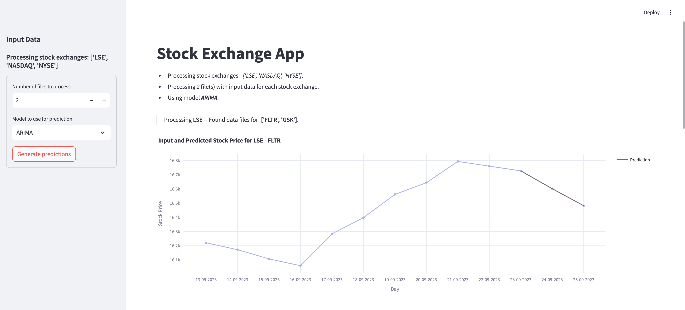

# Stock Price App

The stock price appplication is used to predict the future performance of multiple stock symbols. It uses as input information on past performance and outputs the prediction in the form of CSV files. 

Please check below on how to install and run this application. 

## Installation
- In order to run the app please make sure you create a virtual environment (we recommend Ana(Mini)conda) and install the required packages from **requirements.txt**
- The structure of the app is as follows:

    - ***stock_price_app*** -> contains source code for the app

        - <code>app.py</code> : the main entry point for the app
        - <code>models.py</code> : code for the models used for the prediction
        - <code>utils.py</code> : utilities code for reading and writing data files
        - <code>streamlit_app.py</code> : additional app code for the UI
    
    - ***stock_price_data_files*** -> contains input data files in the form of:

        - <code>folder_stock_exchange </code>

            - <code> file_stock_symbol.csv </code>
            - <code> ... </code>
        - <code> ... </code>
    - ***stock_price_predictions*** -> contains output data files with predictions with the same structure as the *stock_price_data_files*.
    
        > !! This folder does NOT have to be created - the app will create it if it doesn't already exist.

## Usage 

There are two main versions of this application. The first one, *Main app*, is run in the form of a command line, while the second, *Streamlit App*, uses Streamlit to offer the user an easy to use UI in order to run the application. 

Both versions use the same source code and entry points to read, analyze, and output the results. 

The main functions required in the challenge and the functions both versions use are the following:
1. <code> utils.get_input_files</code> - used to parse the *stock_price_data_files* in order to preread the input data (stock symbols)
2. <code> utils.read_input_data</code> - used to read and prepare the actual input data (reads the data from the CSVs files and prepares it for prediction</code> - samples the data to 10 data points from a random timestamp) 
3. <code> models.predict</code> - used to run the model and predict the next three values
4. <code> utils.write_output_data</code> - used to write the predictions to CSV

    > *Note 1: These functions are used in the same way in both versions of the app.* 
    
    > *Note 2: RE Tech challenge requirements:*   The requirements in the challenge were to create only two functions: one that reads ALL data and returns 10 data points for each stock symbol, and a second function which uses the output from the first and does the prediction and outputs the results to CSV. But for a more **readable code**, there were four functions defined (as described above), two that only read and write to file, one that prepares the data, and one that does the prediction. 
      This way, the responsability is separated and attributed to clear functions. For example, if, in the future, the data requires to be cleaned and preprocessed, that can be done in the **read_input_data** function and not in the same function that does the reading. Similarly, if, in the future, different models are used for prediction, they can be defined in the **models** source file, and not in the same place that is used to write to file. 

### Main app
Usage: 

<code> python ./stock_price_app/app.py --N <number_files> --model <model_name> </code>

Example:

<code> python ./stock_price_app/app.py --N 2 --model arima </code>

Where:
- <code>N</code> = the number of files to be processed (the only choices are 1 or 2)
- <code>model</code> = the model to be used for prediction (the only choices are 'basic' or 'arima' - case sensitive!)

The application will print on the stdout any information/warning/exception it has encountered in the process run.

### Streamlit app

In order to run the Streamlit App you need to have installed <code>streamlit</code> -- https://streamlit.io/ . (Streamlit is also named in requirements.txt)

Usage:

<code> streamlit run stock_price_app/streamlit_app.py </code>

This will start a streamlit powered UI in the browser that will look like this:

- All configurations (the number of files to be read and the model to be used) should be inputed in the sidebar on the left (eg. Input Data). When the configuration has been decided the user should click on "Generate Predictions".
- The app will generate and save the predictions to file (as in the case of the command line app), and will also display a helper plot for each prediction.
- The app will print to stdout any information/warning/exception it has encountered in the process run.

# Notes
- The app throws an exception if the directory with the input data does not exist or it otherwise encounters a problem in reading the input data. (Any other warnings/logs are printed on the stdout.)
- All commands should be run inside "lseg_tech_challenge" folder, aka the upmost level folder.
- A second 'arima' model was implemented for the sake of functionality.
- The Streamlit UI was developed as a nice-to-have since it did not take a lot of time (~30 min).
